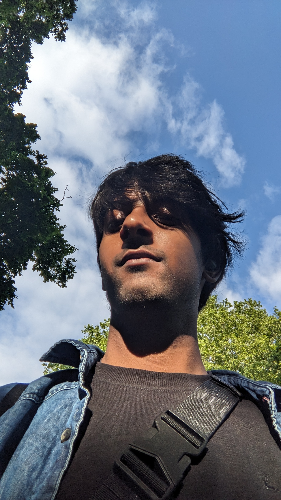

<!-- # Adithyaa Rettaikudi Gurumoorthi -->

I am a final-year student at the Indian Institute of Technology, Madras. I am interested in research topics in **Reinforcement Learning**, **Learning based Controls** and **Theoretical Machine Learning**. 

I love to watch movies, play sports (I am not particularly good at any of them) and travel. From watching sunsets to hearing fiction to spending a day in the grasslands, I love all of them. I also love to cook and experiment with various dishes. 

I also did a semester exchange at the KTH Royal Institute of Technology, Stockholm. It was one of the most magical experiences of my life, with education and a connection with nature. It gave me a new perspective on everything. Along with that, it allowed me to experience travelling and exploring Europe.

## Publications
- [M Reghunath, K Muralidharan, **A R Gurumoorthi** et al. De (l) Noise: A Delaunay based point cloud denoising algorithm." Computers & Graphics (2025): 104310.](https://www.sciencedirect.com/science/article/pii/S0097849325001517)
- [**A R Gurumoorthi**, V Bagaria, B Sebastian. "Interactive steering for seamless transition during control handover in autonomous driving" (accepted for publication)]()

## Research Interests
- Learning based Controls for Robots
- Robot Control and Manipulation
- Reinforcement Learning and Imitation Learning
- Probabilistic Modelling and Application of Machine Learning

## Projects and Experiences

- ### [Learning from Demonstration for Agents with Mismatched Dynamics](/projects/learning_from_demon.md#learning-from-demonstration-for-agents-with-mismatched-dynamics)
Formulate a novel model-based approach to tackle the problem of Learning from Observations. Given the trajectories of expert demonstrators traversing a given environment, we aim to learn the policy for an imitator agent, with possibly different dynamics to act in that environment.

- ### [Computer Vision and Planning Engineer Internship](/projects/ola_krutrim.md#ola-krutrim---embodied-ai)
Worked as a Computer Vision and Planning engineer, aiding their efforts to build an autonomous four-wheeler system to move on rocky terrains and Indian roads.

- ### [User Study for Human Takeover Steering System](/projects/user_study_steering.md#user-study-for-human-takeover-steering-system)

