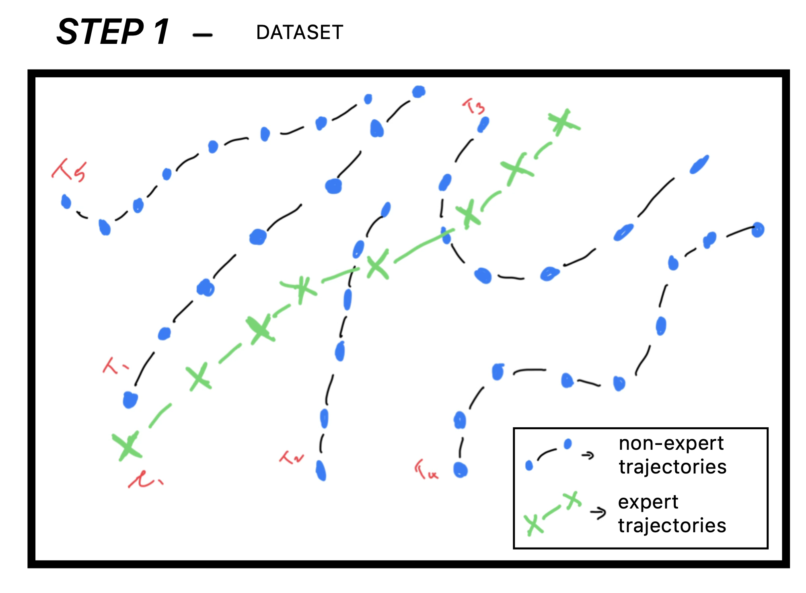
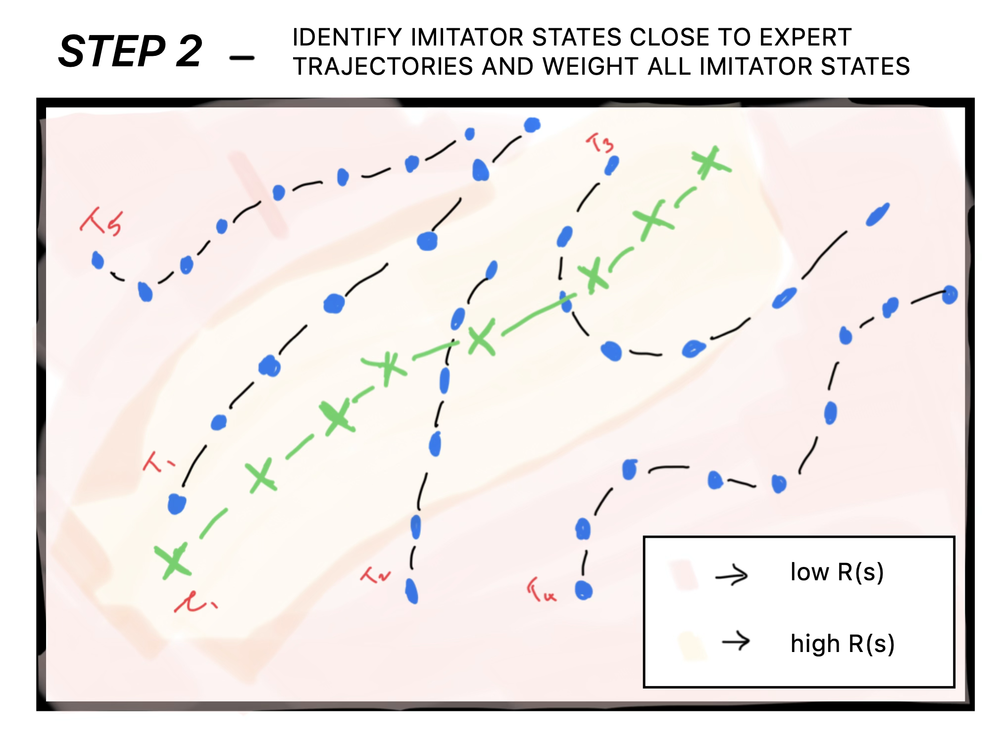
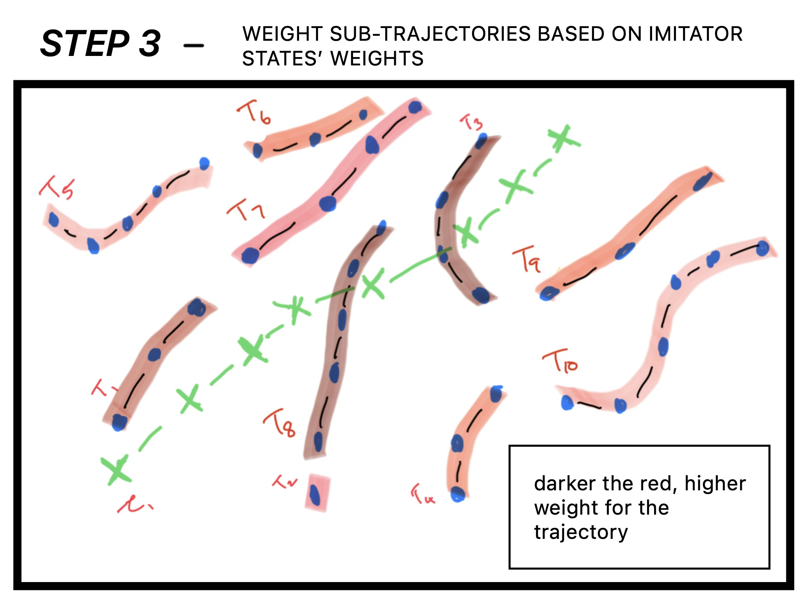

## Learning from Demonstration for Agents with Mismatched Dynamics

### **Advisors**

- **[B Ravindran](https://wsai.iitm.ac.in/~ravi/)**  
  *Center for Responsible AI (CeRAI), IIT Madras*

- **[Nirav Bhatt](https://biotech.iitm.ac.in/innerfaculty.php?fname=Nirav%20P%20Bhatt)**  
  *Department of Data Science and AI (DSAI), IIT Madras*
---

### **Mentor**

- **[Returaj Burnwal](https://returaj.github.io/)**  
  *IIT Madras*
---

### Problem Statement
Robots would struggle to perform complex tasks, such as assisting humans in daily activities, using classical algorithmic approaches. Even with theoretically complete approaches such as Reinforcement Learning, exploration in the real world is sample-inefficient and expensive. These limit the potential of these approaches. 

Imitation Learning solves this problem by learning from data collected from demonstrations. However, the data usually contains action information, which is not always available. 

Learning from Observations (LfO) is a subfield of Imitation Learning that focuses on learning from demonstrations. The observations can be partial, third-person or from the agent itself. The agent also lacks information about the environment's dynamics and the expert's actions. While this is a challenging problem, it is also a more realistic approach to learning policies across agents, given the dynamic complexities of agents such as quadrupeds and humanoids, as well as the difficulty of modelling real-world environments. Humans often exercise these ideas when they learn to tackle new environments or tasks.

I consider the case where we have egocentric state only demonstrations. Based on this information, my project focuses on State-Only Imitation Learning approaches for a parametrically different dynamic robotic agent. This also serves as the first step to a transfer learning scenario within the domain of robotics. 

We are given trajectories of demonstrator experts and we are given mixed distribution trajectories of state-action pairs for the imitator agent.

  

  

  

